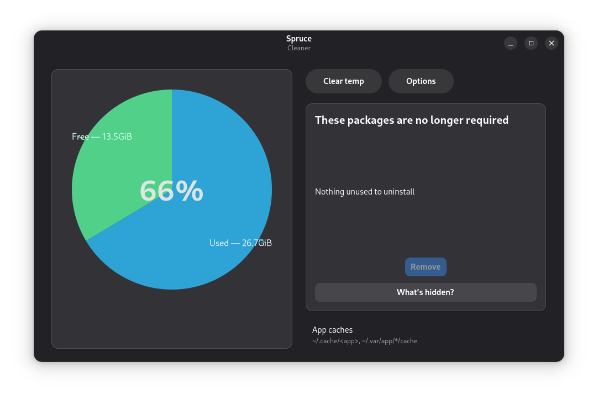
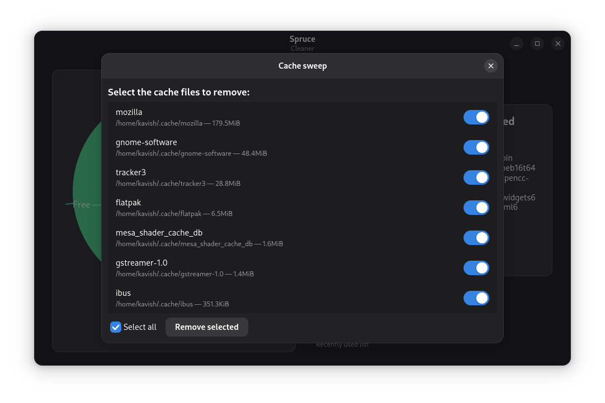

### **Spruce**
**Spruce** is a lightweight cache cleaner and system maintenance tool designed for **GNU/Linux**.
It helps keep your system fresh by clearing unneeded caches, logs, and temporary files in a clean, Adwaita-based GTK interface.

### Features

* **One-click cleaning** for APT, Flatpak, and thumbnail caches
* **Smart cleanup** options that detect removable safely
* **Live disk usage preview** before cleanup
* **Adwaita-Dark inspired UI** with a green accent
* **Lightweight** built with GTK4 + Libadwaita, under 1 MB
* **Python-based** and easy to extend via modules

---

### Usage

Launch **Spruce** from your app menu or by running:

```bash
spruce
```

You’ll see a minimal window with clear sections:

* **Cache Cleaner** — remove APT, Flatpak, and thumbnail junk
* **System Logs** — clear systemd journal files
* **Temp Files** — purge /tmp and user-temp safely
* **Preview Changes** — estimate disk space before cleaning


### Contributing

We welcome contributions and improvements!

1. Fork this repo
2. Create a new branch (`feature/your-feature`)
3. Commit your changes
4. Submit a Pull Request
---

### License

Spruce is licensed under the **GNU GPL v3.0**.
You’re free to use, modify, and redistribute it under the same terms.

---

### Screenshots




---
